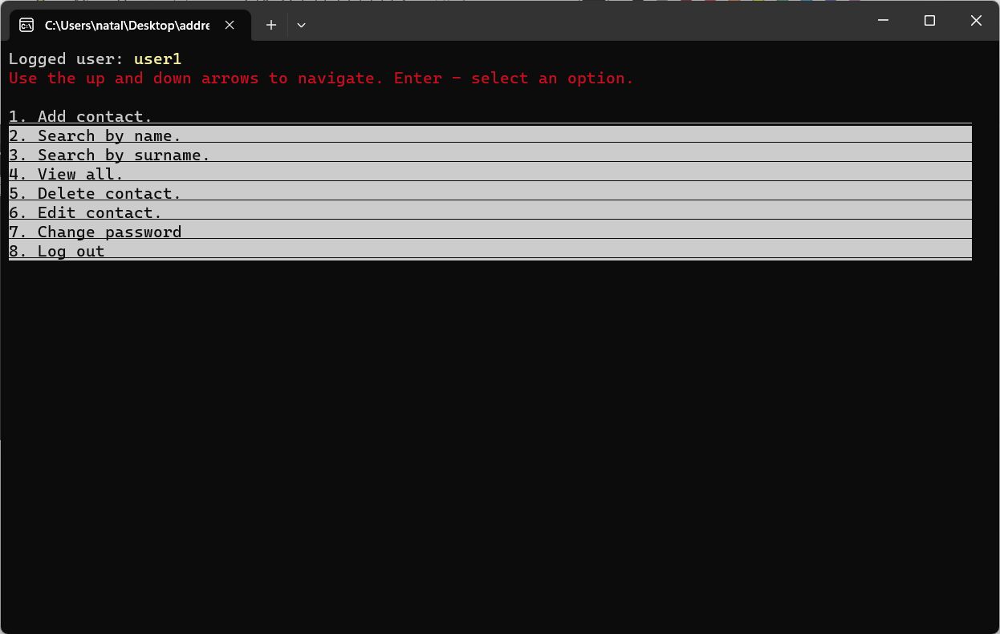

# AdressBookOOP
## Address book console app based on C++ (OOP).

### Features:
- signing up/in/out
- password changing
- adding/removing/editing recipient
- finding recipients by name/surname
- viewing all recipients list
- recipients and users data stored in TXT file

### Screenshots

